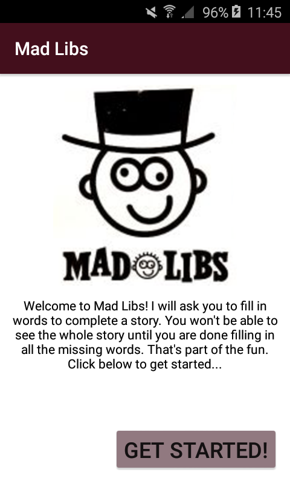
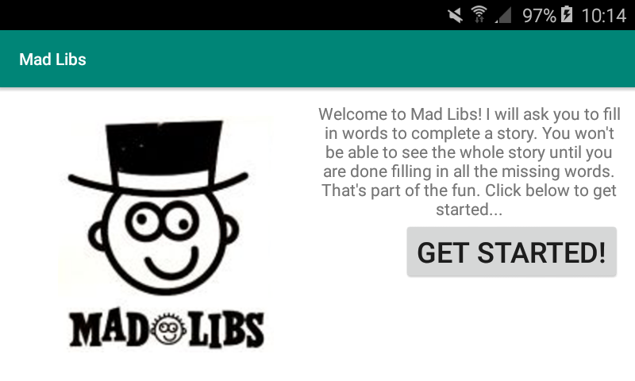
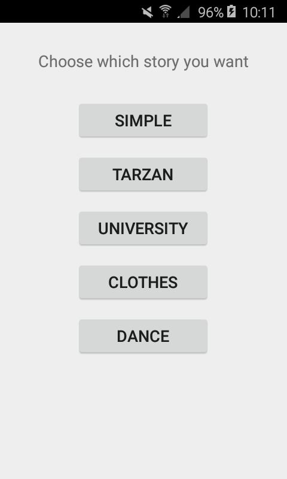
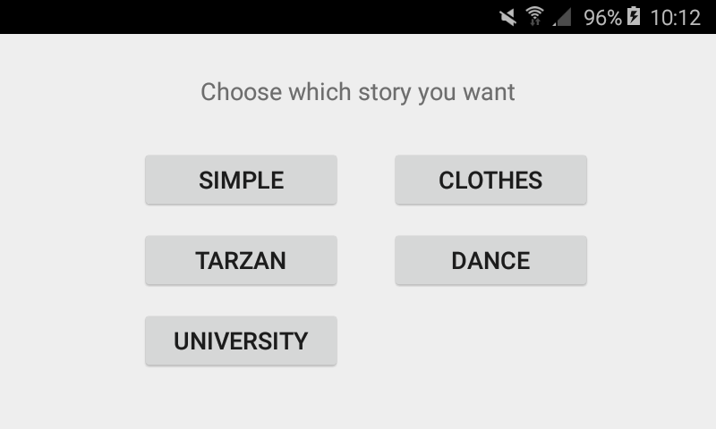
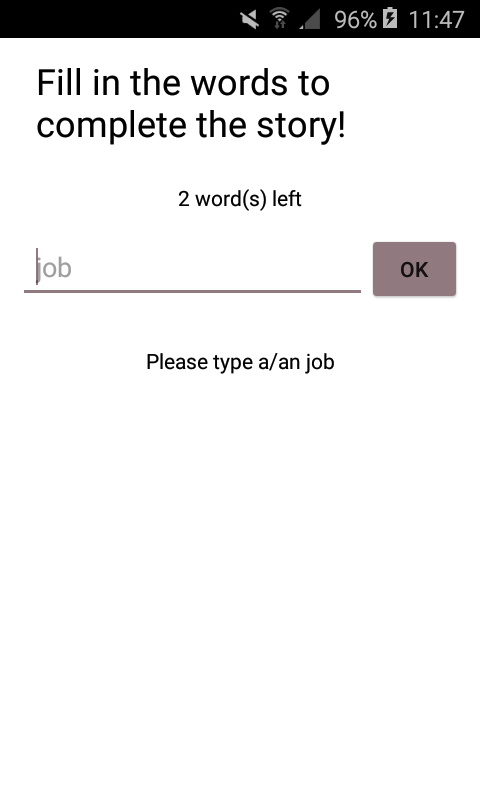
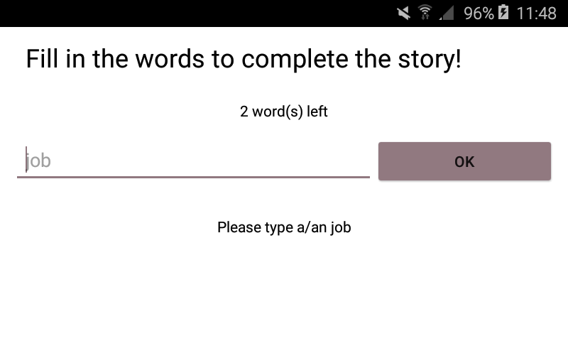
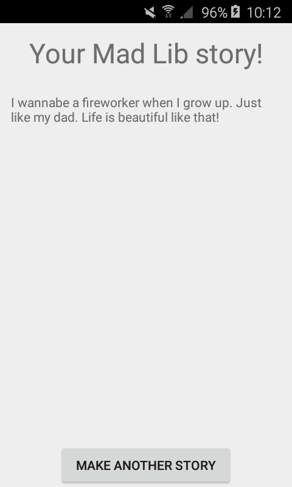
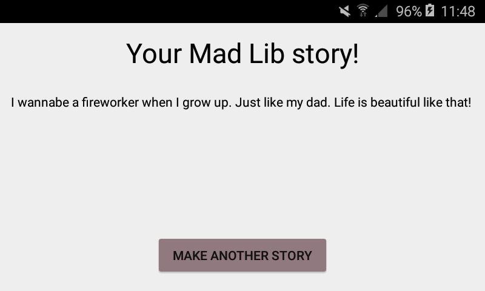
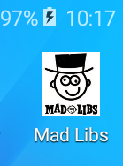

# MadLibs

This is a game where you have to fill in words to complete to story. 

 

You have to choose between five stories.

 

After that you have to fill in the words without knowing how the story is.

 

When you have fill in all the words the story will show and hopefully it is a funny story.

 

The pictogram of the app is like this:

