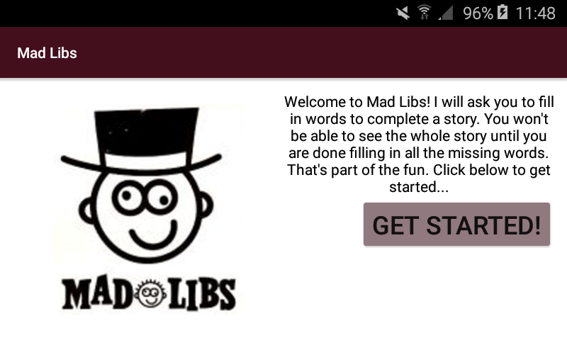
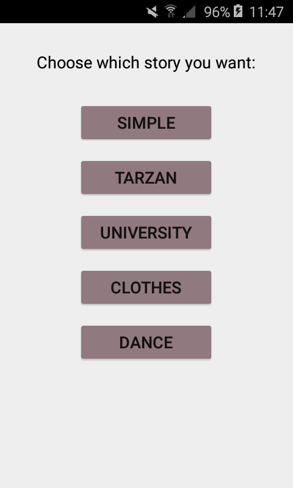
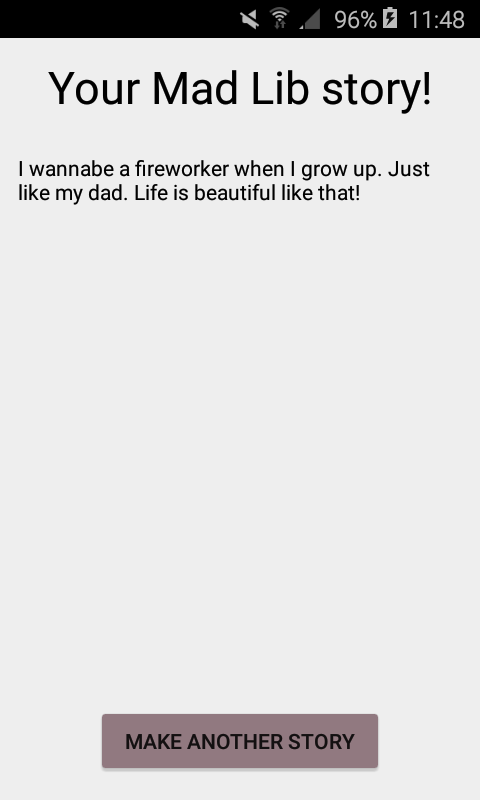

# MadLibs

This app is a game and works as follow:

First click on "GET STARTED".

 

After that you can choose between five stories.

 

When you have choosed a story, you have to fill in words.

 

If all words are filled in your story appear with your filled in words. When you click on "MAKE ANOTHER STORY" you go back to the choise screen and you can make a story again.

 

The pictogram of the app is like this:

Extra: bold text is not available, because this app is in API 22, i have not found a way to make bold text in API 22. 
